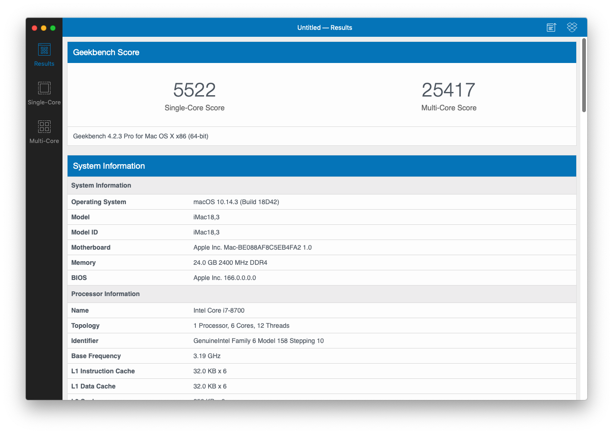
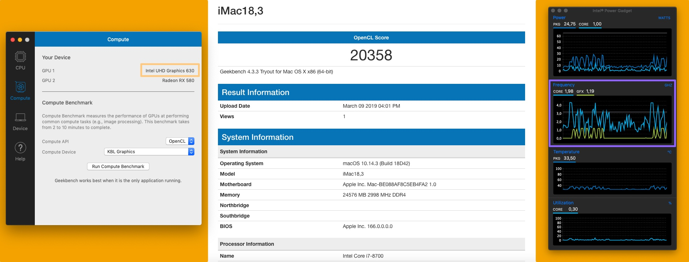
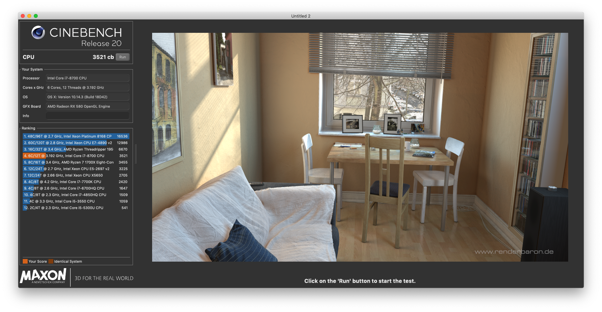
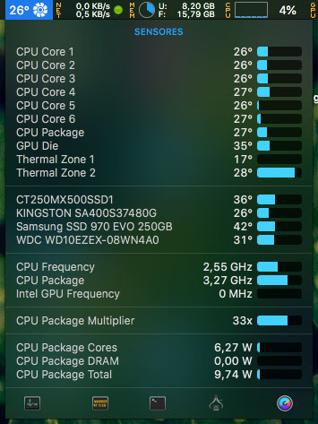

# Pruebas de Rendimiento

## (Geekbench 4.3.3)

Las pruebas de Geekbench son realizadas para evualuar y comparar resultados con otros hardware similares, esto puede variar si tu tienes configurado otro SMBios

- CPU 8700 (no K) https://browser.geekbench.com/v4/cpu/12435066

- GPU 2 -Rx 580 Sapphire

- GPU 1 -Intel UHD Graphics 630 (Puedes ver el recuadro en violeta que se puede ver funcionando)

## Evaluación gráfica (Cinebench 20)

## Temperaturas (con HWMonitor y IStats)

Las temperaturas fueron obtenidas con HWMonitor y los sensores de FakeSMC (Las temperaturas estan tomandas apenas se ha iniciado sesion, Cuando el cpu tiene una carga del 100% alcanza una temperatura de 55C no pasa de eso, es debido al sistema de refrigeracion liquida H100i v2)

Todos estos valores pueden cambiar segun la configuracion que tengas.
